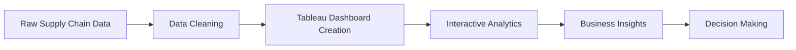

<div align="center">

# 📦 Supply Chain Analytics Dashboard  
### Turning Supply Chain Data into Actionable Business Insights 🚚📈


**An interactive Tableau dashboard project designed to analyze supply chain performance, logistics efficiency, customer behavior, and business profitability.**

### 👨‍💻 Author: **Nilayraj Sharma**

</div>

---

# 📌 Overview

Modern supply chains generate massive volumes of operational data, but converting them into meaningful insights remains challenging.

This project delivers an **interactive Supply Chain Analytics Dashboard** built in **Tableau**, enabling stakeholders to monitor:

✔ Sales Performance  
✔ Profitability Trends  
✔ Shipping Efficiency  
✔ Customer Segmentation  
✔ Delivery Risks  
✔ Geographic Insights  

The dashboard transforms raw data into **strategic business decisions**.

---

# 🎯 Business Problem

Organizations frequently encounter:

🔴 Increasing delivery delays  
🔴 Limited visibility into profitability  
🔴 Customer retention challenges  
🔴 Inefficient logistics operations  
🔴 Difficulty identifying high-performing products  

Without centralized analytics, these issues reduce efficiency and profitability.

---

# 💡 Solution

The dashboard provides:

- Real-time KPI monitoring
- Supply chain performance tracking
- Customer behavior analysis
- Shipping & logistics evaluation
- Geographic sales insights
- Interactive exploration using filters

---

# 🛠 Tech Stack

| Tool | Purpose |
|------|----------|
| **Tableau** | Dashboard Development |
| **Calculated Fields** | KPI Calculations |
| **Maps** | Geographic Analysis |
| **Filters** | Interactive Insights |
| **Charts & KPIs** | Business Visualization |

---

# 📊 Dashboard Breakdown

---

## 📈 Dashboard 1 — Sales & Profit Analysis

### Metrics Covered

💰 Total Sales  
📈 Total Profit  
🛒 Orders Count  
📦 Product Performance  
💵 Average Order Value  

### Key Questions Answered

✅ Which products generate maximum revenue?  
✅ Which categories are most profitable?  
✅ Which products are loss-making?  
✅ What are monthly sales trends?

### Business Impact

Supports:

- Revenue optimization
- Product strategy
- Inventory planning
- Profit growth

---

## 🚚 Dashboard 2 — Logistics & Shipping Analysis

### Metrics Covered

- Delivery Performance
- Shipment Delays
- Shipping Modes
- Cancellation Rates
- Delivery Risk

### Questions Answered

✅ Which shipping methods create delays?  
✅ Which regions experience operational bottlenecks?  
✅ How severe are delivery delays?

### Business Impact

Helps improve:

- Logistics planning
- Shipping efficiency
- Customer satisfaction
- Operational costs

---

## 👥 Dashboard 3 — Customer Analytics

### Metrics Covered

- Customer Segmentation
- Repeat Customers
- Geographic Sales
- Customer Contribution

### Questions Answered

✅ Who are the highest-value customers?  
✅ Which customer segments drive revenue?  
✅ Which regions perform best?

### Business Impact

Supports:

- Customer retention
- Expansion planning
- Targeted marketing
- Segment analysis

---

# 📌 Key Performance Indicators (KPIs)

| KPI | Description |
|-----|-------------|
| Total Sales | Overall Revenue Generated |
| Total Profit | Business Profitability |
| Orders | Total Customer Orders |
| Avg Order Value | Customer Spending Trend |
| Delivery Delay | Shipping Efficiency |
| Repeat Customers | Customer Loyalty |
| Cancellation Rate | Operational Performance |

---

# 🔍 Insights Generated

The dashboard enables businesses to identify:

📌 High-performing products  
📌 Loss-making categories  
📌 Customer purchase behavior  
📌 Delivery bottlenecks  
📌 Shipping inefficiencies  
📌 Regional growth opportunities  

---

# 🚀 Expected Business Outcomes

Using this dashboard can help organizations:

✔ Improve supply chain efficiency  
✔ Increase profitability  
✔ Reduce shipment delays  
✔ Improve customer retention  
✔ Support strategic decision making  


---

# 📂 Repository Structure

```bash
📦 Supply-Chain-Analytics
│
├── 📁 dashboards
│      └── Supplychain.twb
│
├── 📁 images
│      ├── dashboard1.png
│      ├── dashboard2.png
│      └── dashboard3.png
│
└── 📄 README.md
```

---

# 📈 Workflow



---

# 🌟 Conclusion

This project demonstrates how **Supply Chain Analytics + Business Intelligence + Data Visualization** can drive:

- Better operational efficiency
- Faster decision-making
- Improved logistics performance
- Stronger customer understanding
- Higher profitability

---

<div align="center">

## ⭐ If you found this project useful, consider starring the repository!

### Developed by **Nilayraj Sharma** 🚀

</div>
